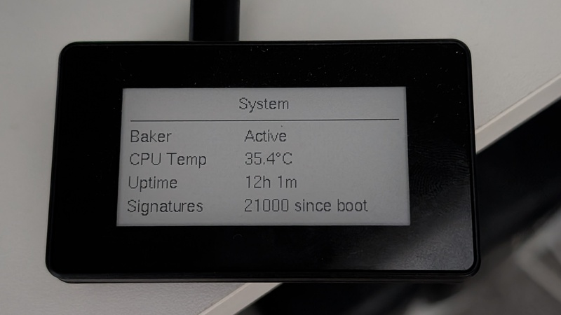

# Russignol

**Hardware Signer for Tezos Baking on Raspberry Pi Zero 2W**

Russignol is a dedicated hardware signing device. Your validator keys stay on isolated hardware.

**Website:** [russignol.com](https://russignol.com) | **Demo:** [YouTube](https://www.youtube.com/watch?v=FO8th1GVkIg)

  

## Why?

[tz4 addresses](https://octez.tezos.com/docs/active/accounts.html#tz4-bls) (BLS signatures) enable [aggregated attestations](https://research-development.nomadic-labs.com/tallinn-announcement.html)—combining hundreds of signatures into one per block. This reduces consensus data by 63x (from ~900 MB/day to ~14 MB/day), allowing all bakers to attest every block instead of ~200 out of ~300. The result: stronger security through full participation, predictable rewards proportional to stake, and reduced overhead that supports further [block time improvements](https://research-development.nomadic-labs.com/tallinn-announcement.html).

Ledger Nano can't perform BLS signatures fast enough for 6-second blocks, and software signers store keys on internet-connected machines—exposing them to remote exploits and memory-scraping attacks.

## Features

- **[BLS12-381](https://octez.tezos.com/docs/active/accounts.html#tz4-bls) signing** — ~6ms via BLST
- **USB gadget ethernet only** — WiFi, Bluetooth, Ethernet compiled out of kernel
- **PIN-protected key storage** — AES-256-GCM encryption, PIN-derived key via Scrypt (256MB memory-hard)
- **Hardened kernel** — Module signature enforcement, kernel lockdown, locked accounts
- **High watermark protection** — Per-key watermarks for consensus and companion key signing, pre-set one level into the future so signing never blocks on disk I/O, Blake3-hashed for corruption detection, persists across reboots
- **Touch-enabled e-ink display** — On-device PIN entry (never crosses USB), menu-based navigation with Status, Activity, Blockchain, Watermarks, About, and Shutdown pages
- **Activity LED** — Visual indication of baker connection
- **CPU frequency scaling** — Idles at 600 MHz, boosts to 1000 MHz during signing and PIN entry
- **Flash-optimized storage** — F2FS with hardware-adaptive alignment, over-provisioning for wear leveling
- **Network mismatch detection** — Warns during key restore if the key's network doesn't match the connected node

## Hardware Requirements

| Component | Specification |
|-----------|---------------|
| **Board** | Raspberry Pi Zero 2W |
| **Display** | Waveshare 2.13" E-ink Touch |
| **Storage** | 8GB+ microSD (high-endurance recommended) |
| **Cable** | USB data cable (not power-only) |

## Getting Started

- [Automated Installation](docs/INSTALL_HOST_UTILITY.md) (recommended)
- [Manual Installation](docs/INSTALL_MANUAL.md)

## Documentation

- [Device Operation](docs/DEVICE_OPERATION.md)
- [Security Audit](docs/SECURITY_AUDIT.md)
- [Host Utility](host-utility/README.md)
- [Configuration](host-utility/CONFIGURATION.md)
- [Key Rotation](host-utility/KEY_ROTATION.md)

### Development

- [Build System](xtask/README.md)
- [Contributing](CONTRIBUTING.md)

## Credits & Attribution

- Inspired by [tezos-rpi-bls-signer](https://gitlab.com/nomadic-labs/tezos-rpi-bls-signer)
- Powered by [blst](https://github.com/supranational/blst)
- Logic ported from [Tezos octez-signer](https://gitlab.com/tezos/tezos/)
- Icons by [Mobirise Icons](https://mobiriseicons.com/)

## Support

[GitHub Issues](https://github.com/RichAyotte/russignol/issues)
